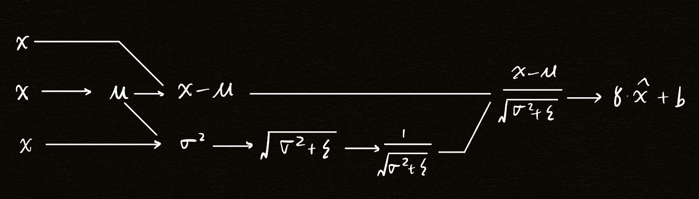
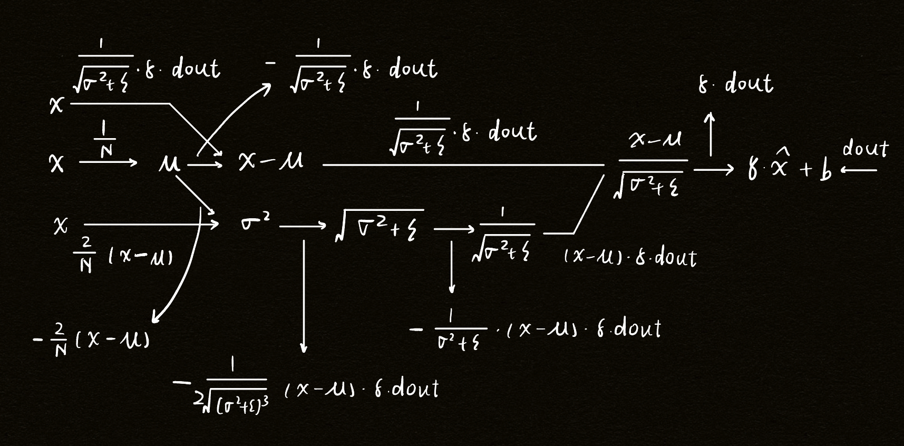

# CNN Architectures

## Quick Recap on CNN

A typical CNN architecture contains three types of layers, respectively
being **convolution layer**, **pooling layer** (including max-pooling
and average pooling), **fully connected layer**.

**Convolution Layer**

The convolution layer comes with layers of filters, which are essentially
a stack of smaller 3D matrices with the same depth as the input serving
as the **weight** as in the fully connected layer.

$$
R = \dfrac{W + 2 \times P - F}{S} + 1 \quad \quad \quad \quad \text{[1]}
$$

The equation $[1]$ describes the output matrix size after a convolution in
which $P$ stands for padding, $F$ stands for filter size (kernel size) and
$S$ stands for stride.

**Pooling Layer**

The pooling layer is used to reduce the matrix size. Just like what we did
in convolution process, we apply a filter to the matrix except that this filter
does not have any parameters.

The filter in max pooling operation servers to extract the maximum value within
the cells covered by the filter as it moves $S$ (stride) number of steps ahead.

Rather than performing the max operation, the general pooling performs the
average operation as it moves $S$ (stride) number of steps ahead.

$$
R = \dfrac{W - F}{S} + 1 \quad \quad \quad \quad \text{[2]}
$$

Equation $[2]$ describes the general method for calculating the matrix size after
a pooling operation.

**Fully Connected Layer**

As the name suggests, layers in the rear end of CNN are fully connected layers as
in regular neural network. The operation here is the same as that in regular neral
network.

## Batch Normalization

### Definition

Sometimes after a dot product, the values in the matrix may become either too large
or too small making it hard for the network to train (values with 0 mean and 1 std
is considered suitable for network training). To address this problem, we introduce
the batch normalization.

$$
\begin{align}
\mu &= \dfrac{1}{N} \sum_{k=1}^{N} x_k \\
\sigma^2 &= \dfrac{1}{N} \sum_{k=1}^{N} (x_k - \mu)^2 \\
\hat{x} &= \dfrac{x - \mu}{\sqrt{\sigma^2 + \epsilon}} \\
\hat{y} &= \gamma \times \hat{x} + \beta
\end{align}
$$

For a $N \times D$ input matrix, batch normalization first sums over axis $0$ to
compute $\mu$ and $\sigma$, resulting in two $1 \times D$ matrices. With these two
matrices, we can then calculate the $\hat{x}$ by performing normalization. Finally,
use $\gamma$ (scale) and $\beta$ (shift) values to add learnable parameters.

One thing to notice is that if $\gamma = \sigma$ and $\beta = \mu$, the normalization
process will bring the input back to its original state.

Another thing to notice is that batch normalization is only valid at training time
since in each training epoch, a batch of input will be sent in while at test time,
only one sample is passing into the model making batch normalization meaningless.

To mitigate this problem, we can use **running mean** and **running variance** method.
Basically, during training time, we constantly accumulate the mean and variance values
we calculated with the help of a new parameter -- $\rho$.

$$
\begin{align}
running\_meaning &= \rho \times running\_meaning + (1 - \rho) + mean \\
running\_variance &= \rho \times running\_variance + (1 - \rho) + variance
\end{align}
$$

### Forward

The forward of batch normalization involves only the use of `np.mean` and `np.var`
with the `axis` parameter set to `0` and `keepdims` set to `True`.

For detailed code implementation, see `assignment2/cs231n/layers.py`.

### Backward

Usually when we try to back propagate a given function, a computation graph will be of
great help. The key to draw a correct computation graph lies in determining the exact
number of inputs and the interconnection between each calculated parts.

> $$
> \begin{align}
> \mu &= \dfrac{1}{N} \sum_{k=1}^{N} x_k \\
> \sigma^2 &= \dfrac{1}{N} \sum_{k=1}^{N} (x_k - \mu)^2 \\
> \hat{x} &= \dfrac{x - \mu}{\sqrt{\sigma^2 + \epsilon}} \\
> \hat{y} &= \gamma \times \hat{x} + \beta
> \end{align}
> $$

The computation graph for the above equations will be the following.

<figure markdown="span">
  { width="800" }
  <figcaption>Fig1. Batch Norm Forward Graph</figcaption>
</figure>

The first key takeaway here is $x - \mu$. Why should we add another $x$ pointing to
the $\mu$ given that we can derive this equation all at once? The reason lies in the
fact that we're reusing $x$ in this case, and it means we're introducing an external
$x$ value which should be back propagated to in the backward pass.

Another key takeaway is that there's a connection between $\mu$ and $\sigma^2$. The
same holds true in this case. According to the equation for calculating the $\sigma^2$,
we reuse the $\mu$ term and it should be back propagated to as well.

The backward computation graph is displayed below.

<figure markdown="span">
  { width="800" }
  <figcaption>Fig1. Batch Norm Backward Graph</figcaption>
</figure>

The sample code for back prop is shown below (The variable `cache` originates from the
forward method. Refer to `layers.py` for in-detail implementation).

```Python
def batchnorm_backward(dout, cache):
    """Backward pass for batch normalization.

    For this implementation, you should write out a computation graph for
    batch normalization on paper and propagate gradients backward through
    intermediate nodes.

    Inputs:
    - dout: Upstream derivatives, of shape (N, D)
    - cache: Variable of intermediates from batchnorm_forward.

    Returns a tuple of:
    - dx: Gradient with respect to inputs x, of shape (N, D)
    - dgamma: Gradient with respect to scale parameter gamma, of shape (D,)
    - dbeta: Gradient with respect to shift parameter beta, of shape (D,)
    """
    dx, dgamma, dbeta = None, None, None
    ###########################################################################
    # TODO: Implement the backward pass for batch normalization. Store the    #
    # results in the dx, dgamma, and dbeta variables.                         #
    # Referencing the original paper (https://arxiv.org/abs/1502.03167)       #
    # might prove to be helpful.                                              #
    ###########################################################################
    # *****START OF YOUR CODE (DO NOT DELETE/MODIFY THIS LINE)*****

    x_hat = cache["x_hat"]
    x_origin = cache["x_origin"]
    gamma = cache["gamma"]
    var = cache["var"]
    avg = cache["avg"]

    N, _ = dout.shape
    dbeta = np.sum(dout, axis=0)
    dgamma = np.sum(x_hat * dout, axis=0)

    # dvalues from previous layers
    dx_hat = dout * gamma
    dvar = np.sum(dx_hat * (x_origin - avg) * -0.5 / np.sqrt(var ** 3), axis=0)
    dmu = np.sum(dx_hat * -1 / np.sqrt(var), axis=0) + dvar * np.sum(-2.0 * (x_origin - avg), axis=0) / N

    # Recall in the forward graph, there're three x contributing to the results
    dx = dx_hat / np.sqrt(var) +  dvar * 2 * (x_origin - avg) / N + dmu / N

    # *****END OF YOUR CODE (DO NOT DELETE/MODIFY THIS LINE)*****
    ###########################################################################
    #                             END OF YOUR CODE                            #
    ###########################################################################

    return dx, dgamma, dbeta
```

## Layer Normalization

Other than batch normalization, layer normalization is another common technique.
Instead of summing over the $0$ axis, layer normalization sums over axis $1$.

To show the difference in detail, consider the following code.

```Python
# Batch Norm
avg = np.mean(x, axis=0, keepdims=True)
var = np.var(x, axis=0, keepdims=True)

# Layer Norm
avg = np.mean(x, axis=1, keepdims=True)
var = np.var(x, axis=1, keepdims=True)
```

The most important difference between layer norm and batch norm is that layer
norm can be safely run in test time without the running mean or running var
technique.

### Forward

The forward method is partially shown in the above code sample. For detailed
implementation, see `layers.py` file.

### Backward

The backward of layer norm runs nearly the same as the batch norm except
that batch norm sums over the number of samples while layer norm sums over
the number of features which leads to a different choice of axis and a
different choice of division number.

To illustrate, consider the core part of backward pass in batch norm.

```Python
dx_hat = dout * gamma
dvar = np.sum(dx_hat * (x_origin - avg) * -0.5 / np.sqrt(var ** 3), axis=0)
dmu = np.sum(dx_hat * -1 / np.sqrt(var), axis=0) + dvar * np.sum(-2.0 * (x_origin - avg), axis=0) / N
```

We sum the `dvar` based on the $0$ axis and we divide part of `dmu` by `N`.

In layer norm, however, we must sum over axis $1$ and keep the dimension
along the way because that's how we calculate the normalization in the first
place. Also, rather than dividing by `N`, we should now divide by `D` (the
second dimension of `dout`).
