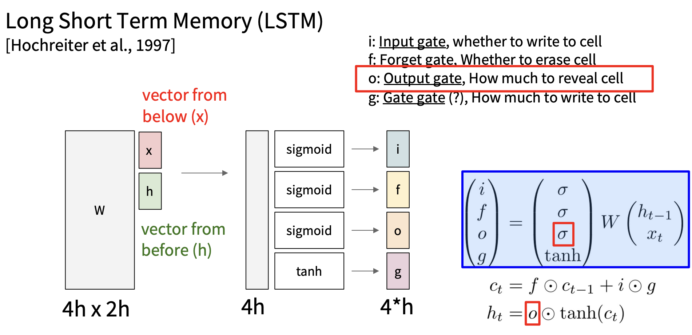
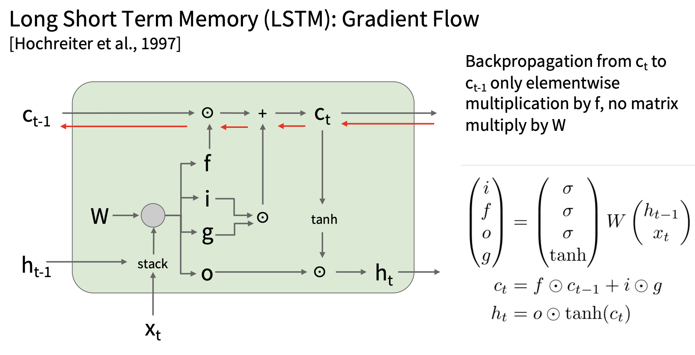

# RNN

So far, we've seen and practiced the so-called "Feed Forward" neural network
which takes in inputs and outputs either a class score or regression value.

But what if the input is a sequence and our required output is another sequence?
For example, in terms of machine translation, our target is to translate a
sequence of characters into another language.

RNN (Recurrent Neural Network) is born to do that. The vanilla RNN is pretty
by definition. The basic building block receives an input, performs some operation
with another variable called "hidden state" in the block and outputs the vector.
This new vector serves as the hidden state of the next building block.

With this basic structure, a bunch of variances can be constructed. The **many to
one** structure takes in a sequence of inputs and outputs one vector. The **one to
many** structure takes in one vector and outputs a sequence vectors. The similar thing
applies to **many to many** structure.

Of the 3 variances mentioned, the "many-to-one" and "one-to-many" are also referred
to as **encoder** and **decoder** respectively.

!!! tip

    I strongly recommend viewing the [original slides](https://cs231n.stanford.edu/slides/2024/lecture_7.pdf) and [the course given by Michigan online](https://www.youtube.com/playlist?list=PL5-TkQAfAZFbzxjBHtzdVCWE0Zbhomg7r)

## Example

Suppose we're trying to build a model that takes a characters and predict the next character
iteratively (something similar to GPT).

### Calculating Hidden State

The first we want to do is finding a suitable way to represent each letter. In this case
we'll just use an one-hot vector to encode each character. The next thing is calculating
the hidden state for the next building block.

To be more specific, we have the following formula.

$$
h_t = f_W(h_{t-1}, x)
$$

$f_W$ is a short hand for weight matrix. To expand the above formula, we have:

$$
h_t = f\left(W \cdot \begin{pmatrix} h_{t-1} \\ x \end{pmatrix}\right)
$$

Notice here we're performing a dot product. It's correct but considering the fact that
$x$ is a one-hot vector, performing a dot product is slower comparing to just selecting
the corresponding weight vector, which leads us to **Embedding Layer**. Embedding layer
is nothing more than the dot product between a one-hot vector and a weight matrix.

Now that we've finished calculating the next hidden state and output a character, the
logical step is to input this predicted character to the same model and keep on with
the exact training process.

### Loss, BackProp

As a reasonable next move, we should now think about the loss function and the back
propagation procedure.

Without diving into computation details, these two processes seem pretty normal. However,
what if our model has a depth of 100 or even 1000 since we might want our model to translate
the entire paragraph or even the entire article? In such cases, the back propagation process
will need to store a ton of weight, input, hidden state matrices just for a single backward
pass. Our GPU memory will easily run out.

That's why **Truncated Back Propagation** is put forward. The basic idea for truncated backward
is that the entire network is truncated into parts of chunks. For each chunk of regular size,
we perform the forward pass operation, store the hidden state matrix and compute the backward
gradients. For the next chunk, all we need is the newly-computed hidden state, without the need
for previous matrices since they're already updated.

## Another Example

Another application for RNN is image captioning. This can be done in 3 steps.

**Extracting Image Features**

The raw image first passes through a convolution layer to extract the image features.

**Add Features to RNN**

Recall the formula above where we calculate the current hidden state.

> $$
> h_t = f_W(h_{t-1}, x)
> $$

We simply add another parameter to this function.

$$
h_t = f_W(h_{t-1}, x, img)
$$

But what is the $x$?

**Defining Start And End Token**

In the case of image captioning, there's no initial character to inform the model
to starting predicting the next. To resolve this, we need to set a special token
**<start\>** to enable the prediction sequence. Similarly, the model should output
a **<end\>** token indicating the end of prediction.

## Problems

The problem with this architecture of RNN is that the gradients are prone to becoming
stagnant.

!!! note

    By saying "this architecture", I actually mean the $f$ function is $\tanh$ function

This is because as we back propagates, we're actually accumulating the multiplication
result of weight matrix. The weight matrix may either be greater than 1 or less than 1.
But if we cumulatively multiply this small scalar value (for example, consider $1.2^{100}$),
the result will either be so big that exceeds the maximum a computer can represent or small
enough that can be ignored. The gradients would then fall into stagnancy, often called
vanishing gradients.

## LSTM

To keep the gradients flowing, LSTM introduces another state called **cell state**.

<figure markdown="span">
  { width="800" }
  <figcaption>Fig1. LSTM Forward</figcaption>
</figure>

<figure markdown="span">
  { width="800" }
  <figcaption>Fig2. LSTM Backward</figcaption>
</figure>

In Fig2, we can see the cell state flows backward without obstacle since it only involves
a sum gate and a multiplication gate, the former giving a gradient of 1 and the latter
giving the value of $f$. Since $f$ is sigmoid function, the value is always within range
$(0, 1)$

One thing to keep in mind is that LSTM **does not** eradicate the vanishing/exploding
gradients problem. They still exists in computing the gradients for $h$ (hidden state).
The LSTM simply adds a flowing path for cell state to update so that the entire network
would not run into stagnant.
